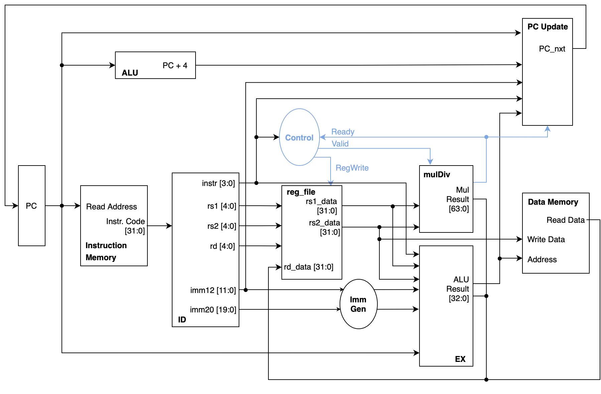

# single-cycle-CPU

### 1. Task
Design a single cycle CPU that can support the following instructions in RISC-V:  
- R-type: add, sub, xor
- I-type: addi, srai, slti, lw
- S-type: sw
- SB-type: beq
- J-type: jal, jalr
- U-type: auipc
- extension: mul

### 2. CPU Architecture

